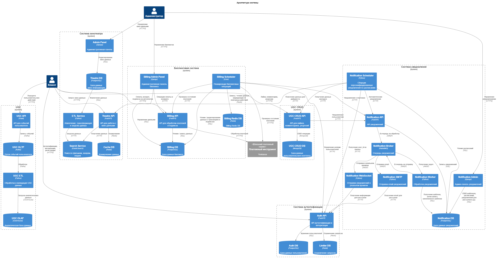

# Сервис онлайн кинотеатра

Проектная работа реализована в рамках курса Яндекс-Практикума `Мидл Python-разработчик`. Создавал сервис как разработчик и тим-лидер команды из 4 человек.

Реализованы следующие сервисы:

- Система кинотеатра ([описание сервиса theatre_service](./theatre_service/README.md))
- Система аутентификации и авторизации ([описание сервиса auth_service](./auth_service/README.md))
- Система сбора UGC ([описание сервиса ugc_service](./ugc_service/README.md))
- Система пользовательской активности: лайки, комментарии, рецензии ([описание сервиса ugc_crud_service](./ugc_crud_service/README.md))
- Система уведомлений ([описание сервиса notification_service](./notification_service/README.md))
- Система биллинга ([описание сервиса billing_service](./billing_service/README.md))

## Схема сервиса

## Запуск сервиса

- Переменные среды для всех сервисов положить в файл *.env* по примеру файла *.env.sample*
- Запустить `docker compose up -d`
- При первом запуске настройте Sentry: получите `sentry_dsn` для каждого сервиса, впишите их в .env файл и перезапустите docker `docker-compose down` `docker compose up -d`
